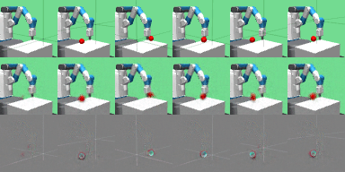

<h1 align="center">Dreaming in goal-conditioned environments</h1>

<p align="center">
  
</p>

This code is building upon the model-based reinforcement learning agent _Dreamer_:
```
@article{hafner2019dreamer,
  title={Dream to Control: Learning Behaviors by Latent Imagination},
  author={Hafner, Danijar and Lillicrap, Timothy and Ba, Jimmy and Norouzi, Mohammad},
  journal={arXiv preprint arXiv:1912.01603},
  year={2019}
}
```
Specifically, it extends the [implementation](https://github.com/danijar/dreamer) by first author [Danijar Hafner](https://github.com/danijar) to also work on robotic goal-conditioned OpenAI gym environments, such as [FetchReach-v1](https://gym.openai.com/envs/FetchReach-v1/). Read more about the goal-conditioned environment suite in [this](https://openai.com/blog/ingredients-for-robotics-research/) OpenAI blog post.

## Instructions

Create the conda environment with all dependencies:
```
conda env create --file conda-env.yml
conda activate dreamer-env
```
This already installs the requirements in `requirements.txt` for you. Make sure you have MuJoCo set up on your machine beforehand (typically in /home/yourname/.mujoco/mujoco_200/). This is not done by conda for you!
Besides the steps in the MoJoCo documentation, I also had to run the following commands inside of the conda env:

```
export LD_LIBRARY_PATH=$HOME/.mujoco/mujoco200/bin:$LD_LIBRARY_PATH
export MUJOCO_PY_MJPRO_PATH=$HOME/.mujoco/mujoco200/
export MUJOCO_PY_MJKEY_PATH=$HOME/.mujoco/mjkey.txt
sudo apt install libosmesa6-dev
```

Maybe libosmesa6-dev could be included inside `conda-env.yml`, but I was not able to find a suitable channel for it.

Train the agent using the specified logdir and robotics environment:

```
python3 dreamer.py --logdir ./logdir/fetch-reach-v1/dreamer/1 --task robotics_FetchReach-v1
```

Generate plots:

```
python3 plotting.py --indir ./logdir --outdir ./plots --xaxis step --yaxis test/return --bins 3e4
```

Start tensorboard with graphs and GIFs:

```
tensorboard --logdir ./logdir
```
