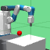

# Dreamer for goal-conditioned environments



This code is building upon Dreamer:

```
@article{hafner2019dreamer,
  title={Dream to Control: Learning Behaviors by Latent Imagination},
  author={Hafner, Danijar and Lillicrap, Timothy and Ba, Jimmy and Norouzi, Mohammad},
  journal={arXiv preprint arXiv:1912.01603},
  year={2019}
}
```

## Instructions

Create conda environment with all dependencies:
```
conda env create --file conda-env.yml
conda activate dreamer-env
```
This already installs the requirements in `requirements.txt` for you. Make sure you have MuJoCo set up on your machine beforehand (typically in /home/yourname/.mujoco/mujoco_200/). This is not done by conda for you!
Besides the steps in the MoJoCo documentation, I also had to run the following commands inside of the conda env:

```
export LD_LIBRARY_PATH=$HOME/.mujoco/mujoco200/bin:$LD_LIBRARY_PATH
export MUJOCO_PY_MJPRO_PATH=$HOME/.mujoco/mujoco200/
export MUJOCO_PY_MJKEY_PATH=$HOME/.mujoco/mjkey.txt
sudo apt install libosmesa6-dev
```

Maybe libosmesa6-dev could be included inside `conda-env.yml`, but I could not find a suitable channel for it.

Train the agent using the specified logdir and robotics environment:

```
python3 dreamer.py --logdir ./logdir/fetch-reach-v1/dreamer/1 --task robotics_FetchReach-v1
```

Generate plots:

```
python3 plotting.py --indir ./logdir --outdir ./plots --xaxis step --yaxis test/return --bins 3e4
```

Start tensorboard with graphs and GIFs:

```
tensorboard --logdir ./logdir
```
